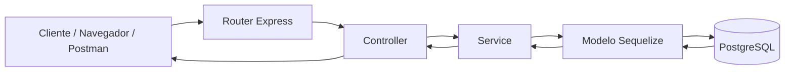
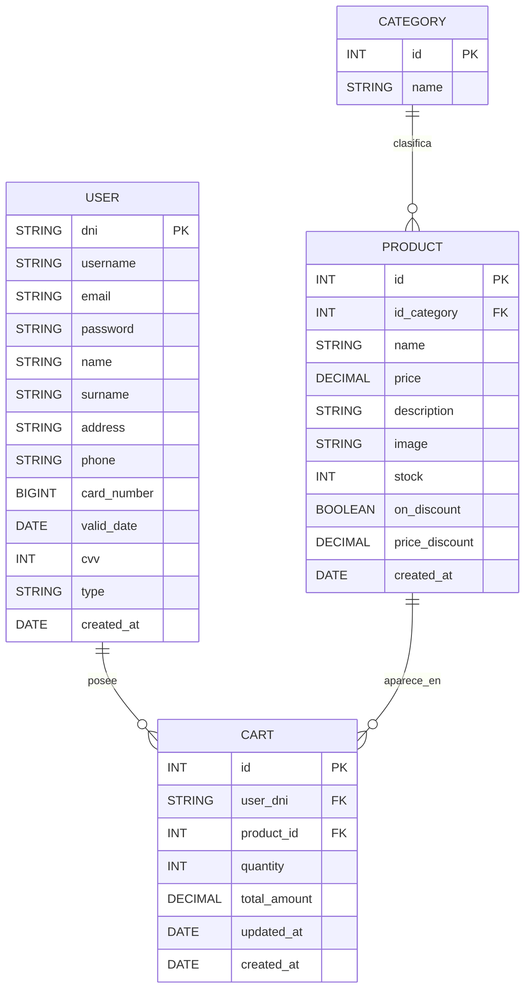
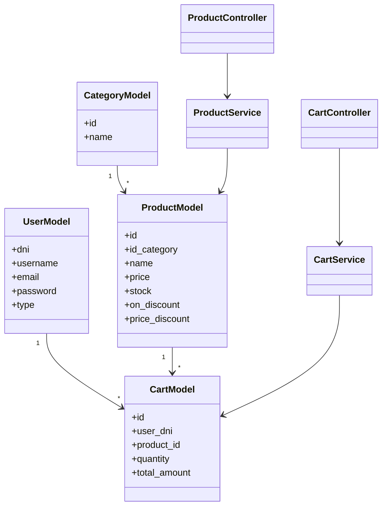

# El Puente Market

## Memoria tecnica resumida

**El Puente Market** es una aplicacion web para un supermercado online desarrollada como proyecto de equipo. El objetivo principal ha sido construir una base funcional de e-commerce con backend en Node.js, base de datos relacional, API REST y vistas web renderizadas en servidor.

El proyecto permite consultar productos y categorias, gestionar usuarios, trabajar con un carrito de compra, simular un checkout y administrar los datos principales desde un panel web.

Repositorio: `https://github.com/David-LS-Bilbao/el-puente-market`

Rama final tomada como referencia: `main`

Ultimo hito de integracion: PR final `dev -> main`, commit `be2bbed`, "Merge final".

## Objetivo del proyecto

El objetivo del equipo ha sido desarrollar una aplicacion completa de supermercado online con las siguientes capacidades:

- Mostrar un catalogo de productos al cliente.
- Organizar los productos por categorias.
- Permitir consultar el detalle de un producto.
- Permitir anadir, modificar y eliminar productos del carrito.
- Simular un proceso de checkout.
- Ofrecer un panel de administracion para productos, categorias, usuarios y carrito.
- Persistir toda la informacion principal en PostgreSQL.
- Separar la logica en rutas, controladores, servicios y modelos.
- Incorporar autenticacion web por sesion y autenticacion API mediante JWT.

## Tecnologias utilizadas

| Tecnologia | Uso en el proyecto |
|---|---|
| Node.js | Entorno de ejecucion del backend |
| Express | Servidor HTTP, rutas web y API REST |
| PostgreSQL | Base de datos relacional |
| Sequelize | ORM para modelos, relaciones y sincronizacion |
| EJS | Motor de plantillas para vistas renderizadas en servidor |
| express-ejs-layouts | Layouts reutilizables para las vistas |
| express-session | Sesion web para login y panel de administracion |
| bcrypt | Hash y comprobacion de contrasenas |
| jsonwebtoken | Generacion y validacion de JWT para la API |
| dotenv | Gestion de variables de entorno |
| nodemon | Recarga automatica en desarrollo |
| Git + GitHub | Trabajo por ramas, commits, PRs e integracion |

## Proceso de trabajo del equipo

El desarrollo se organizo por ramas funcionales. Primero se creo la estructura base del proyecto y la conexion con base de datos. Despues se repartieron las entidades principales entre distintas ramas: usuario, categoria, producto y carrito.

La primera fase se centro en tener un backend minimo funcionando:

- Creacion del proyecto Express.
- Configuracion de Sequelize.
- Conexion con PostgreSQL.
- Modelos iniciales.
- Primeros endpoints API.
- Validacion manual con datos de prueba.

La segunda fase amplio la aplicacion con servicios y controladores mas separados:

- Servicios para usuario, producto, categoria y carrito.
- Controladores API para cada recurso.
- Rutas REST agrupadas bajo `/api`.
- Asociaciones entre modelos Sequelize.

La tercera fase incorporo las vistas:

- Vistas publicas del catalogo.
- Detalle de producto.
- Navegacion por categorias.
- Sidebar de carrito.
- Checkout simulado.
- Panel de administracion.
- Login, registro y logout.

Finalmente se hizo una fase de integracion mediante PRs, donde se juntaron las ramas de vistas, servicios y carrito hasta llegar a la rama `main`.

## Hitos de integracion en GitHub

| Hito | Rama / PR | Descripcion |
|---|---|---|
| Base inicial | `PUENTE-21/creacion-proyecto` | Creacion del proyecto Express |
| Modelos y BBDD | `PUENTE-13`, `PUENTE-14`, `PUENTE-15`, `PUENTE-16` | Tablas principales y relaciones |
| Servicios | `PUENTE-41`, `PUENTE-42`, `PUENTE-43`, `PUENTE-44` | Separacion de logica en capa service |
| Vistas dashboard | `PUENTE-40/creacion-vistas-dash` | Panel de administracion |
| Vistas publicas | `PUENTE-35`, `PUENTE-37`, `PUENTE-38` | Productos, carrito y categorias |
| Integracion vistas | `PUENTE-23/vistas` | Integracion principal de vistas |
| Integracion compra | `task/integracion-productos-categorias` | Carrito, compra y flujo publico |
| Merge final | PR `dev -> main` | Estado final oficial del proyecto |

Tambien se usaron ramas locales y de laboratorio, como `PUENTE-51/test-integracion-vistas` y `test/integracion-from-puente23`, para probar integraciones antes de decidir que cambios debian entrar en la base final.

## Arquitectura general

El proyecto sigue una arquitectura por capas sencilla, adecuada para un proyecto academico de backend con vistas.

```text
src/
  config/          conexion a base de datos
  controllers/     controladores API y vistas
  middlewares/     autenticacion, roles y validaciones
  models/          modelos Sequelize
  routes/          rutas API y rutas web
  services/        logica de acceso a datos
  views/           plantillas EJS
public/            estilos, imagenes y scripts de interfaz
docs/              documentacion y evidencias del proyecto
```

### Flujo de una peticion



## Modelo de datos

El dominio principal del proyecto esta formado por cuatro entidades:

- `user`: usuarios registrados.
- `category`: categorias del catalogo.
- `product`: productos del supermercado.
- `cart`: lineas de carrito que relacionan usuarios y productos.

### Diagrama entidad-relacion



### Diagrama de clases simplificado



## Funcionalidades principales

### Parte publica

La parte publica permite navegar por el catalogo del supermercado:

- Ver productos disponibles.
- Filtrar productos por categoria.
- Ver detalle de un producto.
- Anadir productos al carrito.
- Abrir el sidebar del carrito.
- Modificar cantidades.
- Eliminar productos del carrito.
- Simular el proceso de pago.

### Panel de administracion

El panel de administracion permite gestionar los datos principales:

- Usuarios.
- Productos.
- Categorias.
- Carritos.

El panel esta pensado para usuarios con tipo `admin`.

### Autenticacion

El proyecto contiene dos flujos de autenticacion:

| Flujo | Tecnologia | Uso |
|---|---|---|
| Web | `express-session` | Acceso a vistas protegidas y dashboard |
| API | `jsonwebtoken` | Login API y autorizacion mediante Bearer token |

La contrasena de los usuarios se almacena hasheada con `bcrypt`.

## Rutas principales

### Vistas web

| Metodo | Ruta | Descripcion |
|---|---|---|
| `GET` | `/` | Catalogo principal |
| `GET` | `/:id` | Detalle publico de producto |
| `GET` | `/category/:id` | Productos de una categoria |
| `GET` | `/auth/login` | Formulario de login |
| `POST` | `/auth/login` | Procesar login web |
| `GET` | `/auth/register` | Formulario de registro |
| `POST` | `/auth/register` | Procesar registro |
| `POST` | `/auth/logout` | Cerrar sesion |
| `POST` | `/carrito` | Anadir producto al carrito |
| `POST` | `/carrito/addOne` | Incrementar o reducir cantidad |
| `POST` | `/carrito/delete` | Eliminar item del carrito |
| `GET` | `/checkout` | Resumen de pago |
| `POST` | `/checkout` | Simulacion de pago |

### Vistas de administracion

| Metodo | Ruta | Descripcion |
|---|---|---|
| `GET` | `/admin` | Dashboard principal |
| `GET` | `/admin/user` | Gestion de usuarios |
| `GET` | `/admin/product` | Gestion de productos |
| `GET` | `/admin/category` | Gestion de categorias |
| `GET` | `/admin/cart` | Gestion de carrito |

### API REST

| Recurso | Rutas principales |
|---|---|
| Auth | `POST /api/auth/register`, `POST /api/auth/login` |
| Usuarios | `GET /api/user`, `GET /api/user/:dni`, `POST /api/user`, `PUT /api/user/:dni`, `DELETE /api/user/:dni` |
| Productos | `GET /api/product`, `GET /api/product/category/:id`, `POST /api/product`, `PUT /api/product/:id`, `PATCH /api/product/:id`, `DELETE /api/product/:id` |
| Categorias | `GET /api/category`, `GET /api/category/:id`, `POST /api/category`, `PUT /api/category/:id`, `DELETE /api/category/:id` |
| Carrito | `GET /api/cart`, `GET /api/cart/user/:userDni`, `GET /api/cart/:id`, `POST /api/cart`, `PATCH /api/cart/:id`, `DELETE /api/cart/:id` |

## Puesta en marcha

### 1. Instalar dependencias

```bash
npm install
```

### 2. Configurar variables de entorno

Crear un archivo `.env` tomando como referencia `.env.example`.

Variables necesarias:

```env
PORT=3000
DB_NAME=el_puente_db
DB_USER=admin
DB_PASSWORD=
DB_HOST=localhost
DB_PORT=5432
SESSION_SECRET=
JWT_SECRET=
```

### 3. Preparar base de datos

El proyecto espera una base PostgreSQL accesible desde las variables de entorno. Los modelos se sincronizan desde Sequelize al arrancar la aplicacion.

Durante el desarrollo se han usado datos de prueba para categorias, productos, usuarios y carrito.

### 4. Arrancar el proyecto

Modo desarrollo:

```bash
npm run dev
```

Modo normal:

```bash
npm start
```

URL local por defecto:

```text
http://localhost:3000
```

## Validacion realizada

La validacion del proyecto se ha realizado principalmente de forma manual durante la integracion.

Se comprobaron:

- Conexion con PostgreSQL.
- Sincronizacion de modelos Sequelize.
- Lectura de categorias.
- API de carrito.
- Creacion y borrado de items del carrito.
- Renderizado de vistas EJS.
- Navegacion por catalogo y categorias.
- Sidebar de carrito.
- Acceso al panel de administracion.
- Login, logout y redireccion por sesion.
- Integracion final mediante PR hacia `main`.

El proyecto no incluye todavia scripts automaticos de `test` ni `lint`.

## Decisiones tecnicas

### Uso de Sequelize

Se eligio Sequelize porque permite definir modelos y relaciones desde JavaScript, reduciendo la cantidad de SQL manual necesaria durante el desarrollo.

### Arquitectura por capas

El equipo separo el codigo en rutas, controladores, servicios y modelos para que cada parte tuviera una responsabilidad clara.

### Vistas con EJS

Se eligio EJS para cumplir el requisito de vistas renderizadas desde servidor y poder reutilizar layouts, partials y componentes comunes.

### Carrito como tabla propia

El carrito se implemento como entidad `cart`, relacionando usuarios y productos con cantidad y total acumulado por linea.

### Integracion por ramas

El trabajo se hizo con ramas independientes y merges progresivos. Esto permitio repartir tareas, aunque tambien genero conflictos al integrar vistas, rutas y controladores.

## Limitaciones y mejoras futuras

- Sustituir `sequelize.sync({ alter: true })` por migraciones versionadas.
- Anadir pruebas automatizadas para servicios, controladores y rutas.
- Completar una especificacion OpenAPI/Swagger para la API.
- Unificar mejor los flujos de autenticacion web y API.
- Evitar rutas publicas ambiguas como `/:id` para detalle de producto y preferir `/product/:id`.
- Mejorar la gestion del usuario del carrito para depender siempre de sesion autenticada.
- Revisar campos sensibles en `user`, especialmente datos de tarjeta.
- Completar `.env.example` con todas las variables utilizadas por la aplicacion.

## Documentacion de apoyo

En la carpeta `docs/` se han ido recogiendo documentos de apoyo para la memoria:

- Resumen del proyecto.
- Requisitos y casos de uso.
- Arquitectura de la aplicacion.
- Modelo de datos.
- API REST.
- Pruebas y validacion.
- Decisiones tecnicas.
- Evidencias del proceso.
- Notas de integracion de ramas.

Estos documentos sirven como base para preparar la memoria final en PDF.

## Conclusion

El Puente Market ha evolucionado desde una base inicial de Express y PostgreSQL hasta una aplicacion web con API REST, vistas EJS, panel de administracion, autenticacion y carrito de compra.

El trabajo principal del equipo ha estado en integrar las distintas piezas desarrolladas por ramas: modelos, servicios, controladores, rutas, vistas y estilos. La version final en `main` representa una base funcional de e-commerce academico, con margen de mejora tecnica, pero con los elementos principales del proyecto conectados y demostrables.
