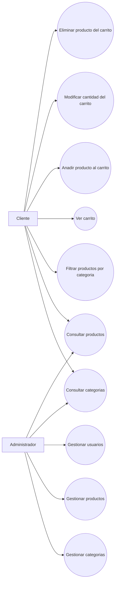

# Requisitos Y Casos De Uso

## Actores principales

- `Cliente`: consulta productos, consulta categorias y opera sobre su carrito.
- `Administrador`: mantiene categorias, productos y usuarios.

## Requisitos funcionales actuales

1. El sistema debe permitir consultar todas las categorias.
2. El sistema debe permitir consultar productos y filtrarlos por categoria.
3. El sistema debe permitir crear, actualizar y eliminar productos.
4. El sistema debe permitir consultar usuarios y gestionarlos.
5. El sistema debe permitir consultar el carrito de un usuario.
6. El sistema debe permitir crear lineas de carrito.
7. El sistema debe permitir modificar cantidades del carrito.
8. El sistema debe permitir eliminar lineas del carrito.

## Casos de uso principales

### Cliente

- Consultar categorias
- Consultar productos
- Consultar productos por categoria
- Ver carrito
- Anadir producto al carrito
- Modificar cantidad del carrito
- Eliminar producto del carrito

### Administrador

- Gestionar categorias
- Gestionar productos
- Gestionar usuarios

## Diagrama de casos de uso

## Notas de alcance

- El proyecto ya soporta la operativa de carrito a nivel de API.
- La seleccion de usuario para operar con el carrito depende hoy de integraciones de frontend y no de autenticacion real.
- Los casos de uso se describen segun el comportamiento que el backend ya permite, no segun pantallas finales pendientes.
