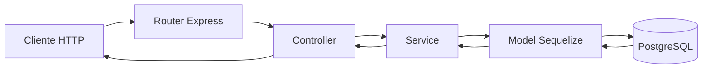
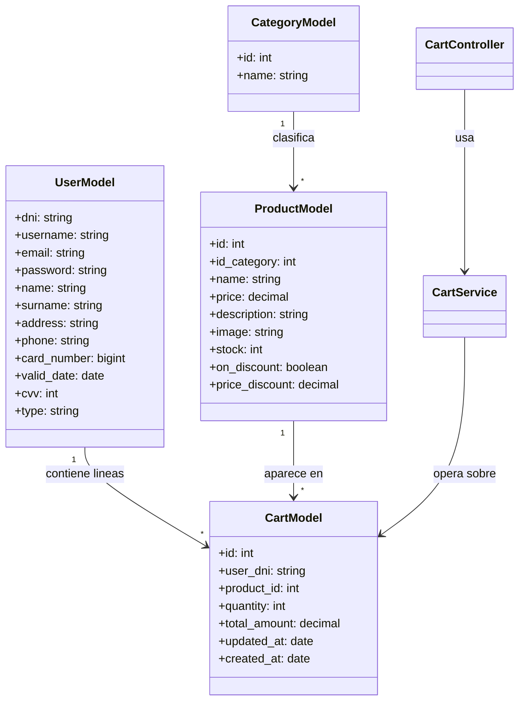

# Arquitectura De La Aplicacion

## Vision general

La aplicacion sigue una arquitectura backend clasica en Express con separacion por capas:

- `routes`: define endpoints y delega en controladores
- `controllers`: traduce la peticion HTTP a logica de negocio
- `services`: encapsula el acceso a datos y operaciones sobre modelos
- `models`: define entidades y relaciones en Sequelize
- `config`: centraliza la conexion a la base de datos

## Flujo de peticion

## Componentes principales

### Entrada de la aplicacion

`src/index.js` inicializa Express, carga variables de entorno, registra middlewares de parsing y monta el router principal.

### Conexion a base de datos

`src/config/db.js` crea la instancia de Sequelize y ejecuta:

- `checkDB()`
- `syncDB()`

### Router principal

`src/routes/router.js` monta `/api` como punto de entrada de la API.

### Router API

`src/routes/api/apiRouter.js` distribuye las peticiones entre:

- `category`
- `product`
- `user`
- `cart`

## Diagrama de clases simplificado

## Observaciones tecnicas

- El proyecto usa una arquitectura sencilla y mantenible para un contexto academico o de equipo pequeno.
- La capa de servicios reduce acoplamiento entre controladores y Sequelize.
- La ausencia de autenticacion hace que el usuario activo se gestione por integracion de frontend y no por middleware de sesion.
