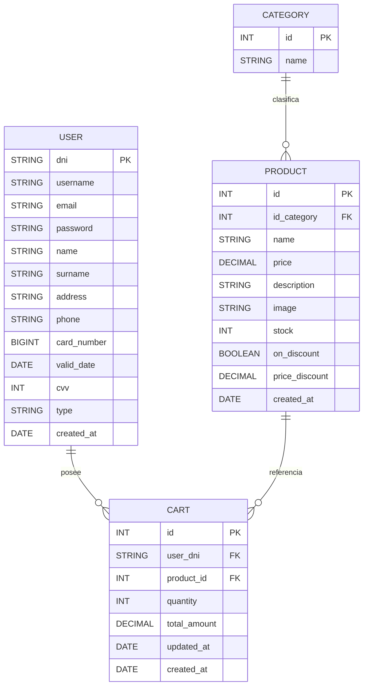

# Modelo De Datos

## Entidades principales

### `category`

Representa las categorias del catalogo.

Campos principales:

- `id`
- `name`

### `product`

Representa los productos de la tienda.

Campos principales:

- `id`
- `id_category`
- `name`
- `price`
- `description`
- `image`
- `stock`
- `on_discount`
- `price_discount`
- `created_at`

### `user`

Representa los usuarios almacenados en la base de datos.

Campos principales:

- `dni`
- `username`
- `email`
- `password`
- `name`
- `surname`
- `address`
- `phone`
- `card_number`
- `valid_date`
- `cvv`
- `type`
- `created_at`

### `cart`

Representa una linea de carrito que vincula usuario y producto.

Campos principales:

- `id`
- `user_dni`
- `product_id`
- `quantity`
- `total_amount`
- `updated_at`
- `created_at`

## Relaciones

- Una categoria tiene muchos productos.
- Un producto pertenece a una categoria.
- Un usuario tiene muchas lineas de carrito.
- Un producto puede aparecer en muchas lineas de carrito.
- `cart` actua como tabla intermedia entre usuarios y productos.

## Diagrama entidad-relacion

## Reglas de negocio observables

- `product.id_category` debe apuntar a una categoria existente.
- `cart.user_dni` debe apuntar a un usuario existente.
- `cart.product_id` debe apuntar a un producto existente.
- `quantity` representa la cantidad de producto en una linea del carrito.
- `total_amount` representa el total acumulado de esa linea.

## Observacion

En el estado actual del proyecto, la definicion del esquema y las relaciones se resuelven desde Sequelize y se sincronizan automaticamente con la base de datos.
